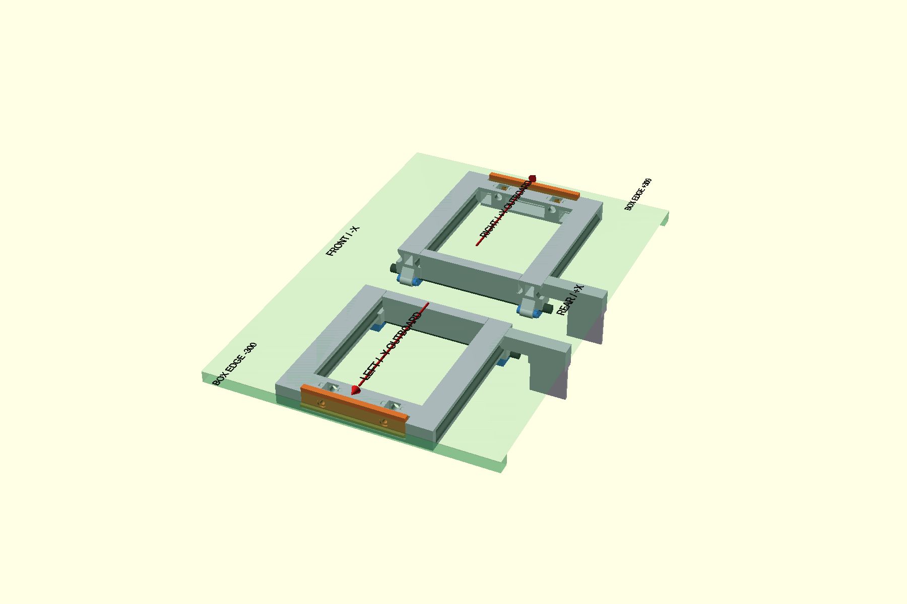

# Eurobox CAD

Automated FreeCAD/OpenSCAD build and validation for the bicycle Eurobox mount.

Current target: **v50**.

## Current validated assembly preview

The single canonical repository preview is:

`cad/v50/assembly/PREVIEW_v50.png`

The image is generated by the main GitHub Actions build from the same validated LEFT/RIGHT STL outputs that are published to `cad/v50/STL/`. `preview-stl/v50/` contains only the STL mirror and links back to this canonical preview; it does not keep a second PNG copy.
